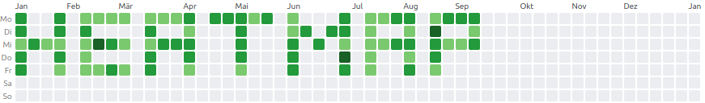

# jQuery Heatmap Plugin

This jQuery plugin generates a visually appealing and interactive heatmap visualization.
It maps data intensity to color variations, providing an intuitive overview of your dataset.



---

## Features

- **Data-Driven Visualization:** Displays data in a heatmap where the color intensity corresponds to data values.
- **Dynamic Data Handling:** Supports both static data arrays and dynamic data fetching via AJAX requests.
  The `startDate` and `endDate` parameters are automatically included in query strings for data fetching.
- **Custom Query Parameters:** Define additional query parameters dynamically using the `queryParams` function without
  overriding standard values like `startDate` and `endDate`.
- **Customizable Design:** Adjust cell sizes, the gap (gutter) between cells, and color gradients.
- **Localization Support:** Automatically adjusts week start days and date formatting based on locale settings.
- **Interactive Tooltips:** Displays tooltips with date and associated data values when hovering over cells.
- **Comprehensive Error Handling:** Handles errors from data fetching or invalid input gracefully.
- **Easy Integration:** Designed with an intuitive jQuery syntax for effortless integration into web projects.

---

## What's New in Version 1.0.1

1. **Default Date Values:**
    - The `startDate` and `endDate` are now automatically set to the first and last day of the current year if not
      explicitly defined.

2. **Query Parameters (`queryParams`):**
    - A new function allows users to dynamically add query parameters without altering the default ones (`startDate` and
      `endDate` are never overridden).

3. **Week Calculation:**
    - Weeks are now calculated dynamically based on custom `startDate` and `endDate`.

4. **Enhanced Color Mapping:**
    - Define color gradients for different data intensity levels with flexible customization.

5. **Debugging Option:**
    - A new `debug` option allows you to log settings and queries to the browser console.

6. **Automatic First Day of the Week:**
    - The plugin determines the first day of the week automatically based on the provided locale.

---

## Installation

1. **Include jQuery and the Heatmap Plugin:**
   ```html
   <script src="https://code.jquery.com/jquery-3.7.1.min.js"></script>
   <script src="dist/jquery.heatmap.js"></script>
   ```

2. **Create a Container Element:**
   ```html
   <div id="heatmap-container"></div>
   ```

3. **Initialize the Plugin:**
   ```javascript
   $('#heatmap-container').heatmap({
       data: [/* Your data array or API URL */],
       startDate: '2023-01-01',
       endDate: '2023-12-31',
       locale: 'en-US',
       // ...other options
   });
   ```

---

## Options

| Option               | Description                                                                                                  | Default Value                                                              |
|----------------------|--------------------------------------------------------------------------------------------------------------|----------------------------------------------------------------------------|
| **`data`**           | Array of data points or a URL from which data will be fetched.                                               | `null`                                                                     |
| **`startDate`**      | Start date of the heatmap. Defaults to the first day of the current year.                                    | `${currentYear}-01-01`                                                     |
| **`endDate`**        | End date of the heatmap. Defaults to the last day of the current year.                                       | `${currentYear}-12-31`                                                     |
| **`queryParams`**    | A function returning additional query parameters. Example: `{ locale: 'en-US' }`.                            | `() => {}`                                                                 |
| **`gutter`**         | The gap between heatmap cells (e.g., `2px`, `4px`).                                                          | `2px`                                                                      |
| **`cellSize`**       | The size of each heatmap cell in pixels.                                                                     | `14px`                                                                     |
| **`colors`**         | An object defining the heatmap's color gradient. Keys are thresholds between `0` and `1`. Values are colors. | See gradient below                                                         |
| **`locale`**         | Locale for displaying dates and determining the first day of the week.                                       | `en-US`                                                                    |
| **`debug`**          | If `true`, settings and queries are logged to the console.                                                   | `false`                                                                    |
| **`titleFormatter`** | A function to format the tooltip content, receiving locale, date, and count as arguments.                    | `(locale, date, count) => date.toLocaleDateString(locale) + " - " + count` |

---

## First Day of the Week (`firstDayOfWeek`)

- The plugin automatically calculates the **first day of the week** using the provided `locale` setting.
- Example: In the `en-US` locale, the first day of the week is **Sunday (0)**, while in `de-DE` it is **Monday (1)**.
- This behavior is handled internally and does not require additional configuration.

---

## Methods

### Initialize:

```javascript
$('#heatmap-container').heatmap(options);
```

### Update Settings:

```javascript
$('#heatmap-container').heatmap('updateOptions', {
    startDate: '2024-01-01',
    endDate: '2024-06-30',
});
```

---

## Example

### Simple Data Initialization:

```javascript
$('#heatmap-container').heatmap({
    data: [
        {date: '2023-01-01', count: 5},
        {date: '2023-01-02', count: 10},
        // Add more data points here...
    ],
    startDate: '2023-01-01',
    endDate: '2023-12-31',
    colors: {
        0: '#ebedf0',
        0.25: '#c6e48b',
        0.5: '#7bc96f',
        0.75: '#239a3b',
        1: '#196127'
    },
});
```

### Query Parameters Example:

Include additional query parameters dynamically using the `queryParams` function:

```javascript
$('#heatmap-container').heatmap({
    data: '/api/data',
    queryParams: () => {
        return {
            locale: 'en-US',
            userId: 123, // Add custom parameters
        };
    },
});
```

---

## Debugging

Enable debugging to log data and settings in the browser console.
This can be useful for development and error diagnosis:

```javascript
$('#heatmap-container').heatmap({
    debug: true, // Enable debugging
    startDate: '2023-01-01',
    endDate: '2023-12-31',
});
```

---

## Color Gradient

By default, the heatmap's color intensity is mapped to the following scale:

| Threshold (%) | Color     |
|---------------|-----------|
| 0             | `#ebedf0` |
| 25            | `#c6e48b` |
| 50            | `#7bc96f` |
| 75            | `#239a3b` |
| 100           | `#196127` |

You can customize it by passing your own `colors` configuration:

```javascript
$('#heatmap-container').heatmap({
    colors: {
        0: '#f0f0f0',
        0.5: '#00ff00',
        1: '#0000ff'
    }
});
```

---

## Contributing

Contributions are welcome! Feel free to report bugs, request features, or submit pull requests.

---

## License

This plugin is available under the [MIT Licence](LICENSE).
